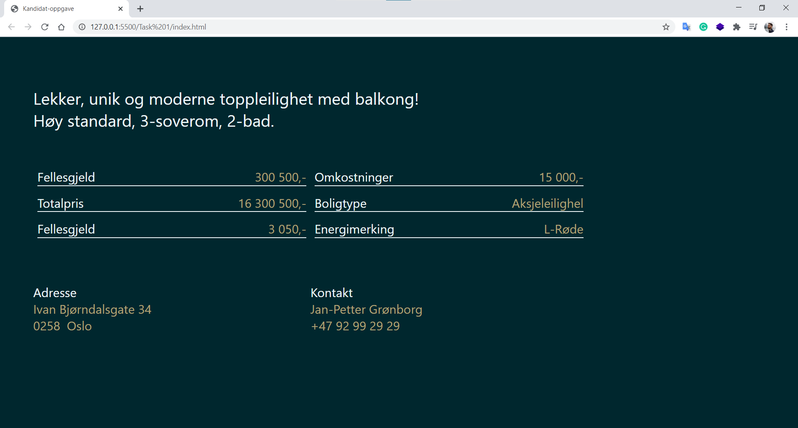

<p align="center">

  <h3 align="center">Kandidat-oppgave</h3>

  <p align="center">
    Candidate task. Recreating an image model and creating a sorting and filtering function. Both while fetching data from a JSON file.
    <br />
  </p>
</p>

## The Project

<a href="https://nord-agency-gdhebling.netlify.app/" alt="Website Screenshot"></a>

This application consist of two tasks:

1. An interface that fetches data from a JSON list and renders them accordingly. All of the fields from the screen are coming from this list.
2. A function that receives a list of names, values, and descriptions, sorts from highest to lowest value, and removes invalid descriptions as empty values, "0", "no" or "false"

## Getting Started

Please refer to the deployed links to check both tasks, or follow the next steps to get a local copy.

Task 1 deployed at:  
Task 2 deployed at:

### Installation

1. Clone a copy of the repo:

   ```sh
   git clone https://github.com/gdhebling/kandidat-oppgave.git
   ```

2. Run a local server
   ```sh
   npm install
   ```

## Usage

### Task 1

For the first task, the application is fetching data from data.json. It fetches data from an array of objects containing "title", "details", "contact", and "address". It then renders onto an interface built using plain CSS and mainly styled using flexbox.  
None of the fields from the interface are hard-coded, and it is also possible to add more array mapping within the render function to accommodate possible differences in the number of fields provided.

### Task 2

For the second task, the data comes from a local data.json as well, and the function runs in two steps. The first is filtering the list to only contain items that have a description of "valid" or "true". The second part is the actual sorting of the data.

## Contact

Gui Hebling -  
https://gdhebling.com  
gdhebling@outlook.com

<p align="left">
<a href="https://gdhebling.com"></a>
&nbsp;&nbsp;
<a href="https://www.linkedin.com/in/gdhebling/"></a>
&nbsp;&nbsp;
<a href="https://twitter.com/gdhebling"></a>
</p>
